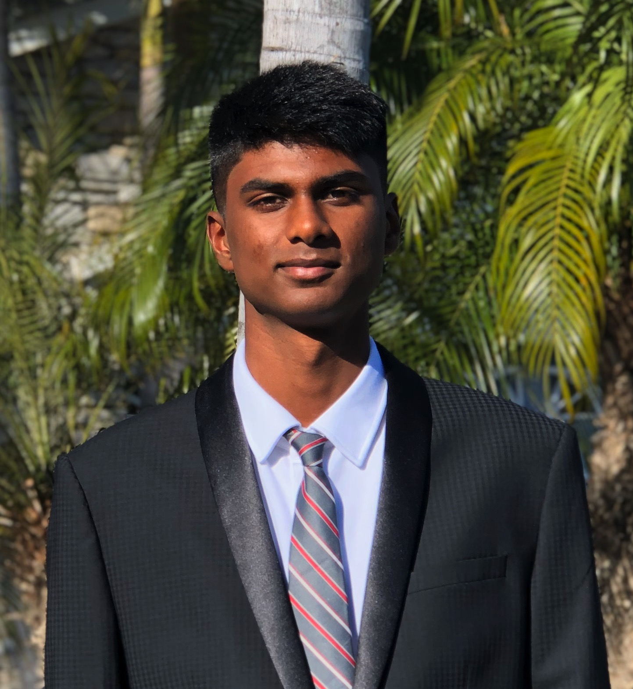

#  &nbsp; &nbsp; &nbsp; &nbsp;Likith Palabindela

## Here are some facts about me
- I'm a junior at UCSD studying **Computer Science**.
- **Machine Learning** and **Neural Networks** are some of my interests.
- One of my favorite quotes is by George Elliot:
    > It is never too late to be what you might've been.
- I love playing basketball, working out, spending time with my friends.
- I love rap/trap music, some of my favorite artists include:
    1. [Lil Uzi Vert](https://en.wikipedia.org/wiki/Lil_Uzi_Vert)
    2. [Young Thug](https://en.wikipedia.org/wiki/Young_Thug)
    3. [Future](https://en.wikipedia.org/wiki/Future_(rapper))

- `Wolfram Mathematica` was one of my first and favorite programming langauges. It is also somewhat of an unorthodox langauge since it is not used in industry more often than it is in research.
- Some of the `git` commands I used were:
  - `git add` to add files to the repo
  - `git commit` to commit the changes
  - `git push` to push the final changes to the repo

## My goals for CSE 110
- [x] Be motivated and stay on top of work
- [ ] Collaborate with future teammates in order to form the best possible synergy
- [ ] Go in with an open mind and take everything as a learning experience
- [ ] Improve team skills and communication skills for efficiency and transparency
- [ ] Take any advice to become the best possible software engineer